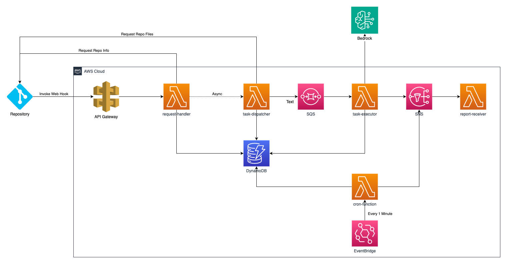

# Code Reviewer - v1.5.1

## 1. 项目介绍

这是一个通过Bedrock进行代码评审的解决方案。通过把项目的代码、设计的原则、评审的规则、输出的要求等信息组织成为提示词，交给大模型来分析，大模型可以给出许多有建设性的意见。

本解决方案打通了常见的代码仓库，只需要简单的安装，便可在AWS云上构建出一套无服务器的代码评审框架，在代码仓库发生诸如push、merge等事件的时候，Web Hook调用本方案所创建的api接口，从而进行任务拆解，依次通过Bedrock调用大语言模型，并最终形成代码评审报告。

## 2. 安装过程

安装过程请参看文档《[CloudFormation安装法](doc/installation.md)》

说明：

- 如果你只是使用本方案，或者进行简单微调（例如：修改Lambda代码），CloudFormation的安装方法是适合的
- 如果你希望二次开发本方案，进行持续迭代，推荐通过CDK方式安装，可参看文档《[CDK安装法](doc/installation-cdk.md)》
- 当前版本仅仅支持部分区域，详情请参看安装文档。

## 3. 项目架构



## 4. 代码结构

```
.
├── CHANGELOG.md                    # 变更日志
├── CODE_OF_CONDUCT.md              # 行为准则
├── LICENSE                         # 许可证文件
├── README.md                       # 主要文档
├── tsconfig.json                   # TypeScript配置
├── bin
│   └── code-reviewer.ts            # CDK主入口
├── doc                             # 文档目录
│   ├── installation.md             # CloudFormation安装文档
│   ├── installation-cdk.md         # CDK安装文档
│   ├── testing-guide.md            # 测试指南
│   └── ...                         # 其他文档
├── lambda                          # Lambda函数源码目录
│   ├── base.py                     # 基础功能包
│   ├── cloudfront_func.js          # CloudFront Function用于Web Tool的域名转向
│   ├── codelib.py                  # 代码仓库相关代码，内部可引用gitlab_code, github_code等模块
│   ├── cron_function.py            # 定时任务，定期清理失败任务，确保15分钟内发出报告
│   ├── github_code.py              # GitHub相关代码
│   ├── gitlab_code.py              # GitLab相关代码
│   ├── logger.py                   # Logger配置，定制了JSON输出格式
│   ├── model_config.py             # 模型配置管理
│   ├── report.py                   # 用于产生Report的相关代码
│   ├── report_receiver.py          # 接收SNS消息，发送邮件或其他通知
│   ├── report_template.html        # Code Review Report模板
│   ├── request_handler.py          # 代码仓库Webhook接收函数
│   ├── result_checker.py           # 代码评审任务状态检查，用于客户端轮询检查任务进度
│   ├── rule_loader.py              # 获取指定分支下所有规则
│   ├── rule_updater.py             # 更新指定的规则文件
│   ├── task_base.py                # 任务相关共性方法
│   ├── task_dispatcher.py          # 任务拆解者，拆解成子任务放入SQS
│   └── task_executor.py            # SQS消费者，每一个消息对应一次Bedrock调用
├── layer                           # Lambda Layer目录（需通过build-layer.sh进行build）
├── lib                             # CDK Stack定义目录
│   ├── api-stack.ts                # API Gateway & Lambda相关CDK代码
│   ├── bucket-stack.ts             # S3相关CDK代码
│   ├── code-reviewer-stack.ts      # CDK代码主入口
│   ├── cron-stack.ts               # 定时任务相关CDK代码
│   ├── database-stack.ts           # DynamoDB相关CDK代码
│   ├── nag-suppressions.ts         # CDK Nag抑制规则
│   ├── sns-stack.ts                # SNS相关CDK代码
│   └── sqs-stack.ts                # SQS相关CDK代码
├── scripts                         # 脚本目录
│   ├── build-layer.sh              # Layer构建脚本
│   ├── deploy-cdk.sh               # CDK部署脚本
│   ├── invoke_bedrock_youself.py   # 根据Payload调用Bedrock的脚本
│   └── test_local.py               # 本地测试脚本
├── simulation-data                 # 模拟测试数据目录
├── test                            # 测试目录
└── webtool                         # Web Tool源码目录

```

## API介绍

- **POST /codereview**

  触发代码评审流程，由request_handler.py处理。每次收到请求，都会产生一个request_id代表本次请求，用于记录和查询本次代码评审的结果。

  Header:

  - X-API-KEY，API Gateway的API Key，这是个可选项

  Post Data:

  - 代码仓库WebHook的结构体

  Response:

  - request_id，请求ID，每次代码评审请求
- **GET /rules**

  获取指定的分支下所有的代码评审规则，会获取指定分支下.codereview/*.yaml，并将结果整理成为JSON Array返回。

  Query Parameter:

  - repo_url, 代码仓库URL，例如 http://gitlab.teonbox.com
  - project_id, 代码仓库名称或ID，例如 demo/first
  - target_branch, 代码仓库分支，例如 dev
  - private_token, Access Token

  Response：

  - 评审规则JSON Array
- **PUT /rules/{filename}**

  Post data:

  ```
  {
  	"repo_url": "代码仓库URL",
  	"project_id": "代码仓库名称或者ID",
  	"target_branch": "代码仓库分支",
  	"private_token": "Access Token",
  	"content": "规则文件内容",
  }
  ```

  Response:

  - None
- **GET /result**

  获取某次代码评审的结果

  QueryString:

  - commit_id,
  - request_id, 请求ID

  Response:

  ```
  {
  	"succ": True, 
  	"ready": True / False, 是否已经完成全部任务
  	"url": "报告地址", 
  	"summary": "当前任务情况摘要描述", 
  	"tasks":  [任务数据, ... ]
  }
  ```

## 5. Lambda函数介绍

方案部署后会产生多个Lambda函数，会以部署时的Project Name参数作为前缀。例如Project Name=sample-project，则数据初始化Lambda名称为 `sample-project-request-handler`

- **{project_name}-request-handler**

  此Lambda函数接收代码仓库Webhook/Web Tool的请求，在DynamoDB中创建请求记录，异步调用 `{project_name}-task-dispatcher`函数后，立即给出响应。本函数不直接处理业务，只会尽快向代码仓库给出响应以满足最佳实践。

  Web Tool发送的请求中含有参数 invoker=webtool，此时将根据请求中提供的数据模拟评审规则，并执行评审流程。否则，则按照代码仓库的WebHook的请求体进行解析，并执行后续评审流程。

  对应代码 `/lambda/request_handler.py`
- **{project_name}-task-dispatcher**

  此Lambda函数会获取代码仓库的代码，并根据 `{project_name}-rule`表中的配置，分解成多个子任务，每个子任务代表了一次Bedrock的调用。子任务信息将被发送给SQS。

  任务拆解的最后，将会产生一个特殊的type=checker的子任务，用于定期检查整个code review request的进度。

  对应代码 `/lambda/task_dispatcher.py`
- **{project_name}-task-executor**

  此Lambda函数将读取SQS中消息，执行Bedrock操作并更新 `{project_name}-task`表的状态。

  每次Bedrock任务完成后，都会检查整个code review request是否已经全部完成，整体任务完成时将在S3产生Code Review Report，并把结果发送给SNS。

  SQS中有一类type=checker的消息，每10秒执行一次，执行后将被重新放入SQS。这类消息用于检测code review request是否已经完成，超过10分钟都没有完成的code review request将被认定为超时，此时也将以阶段性结果来产生Code Review Report，并把结果发送给SNS。

  对应代码 `/lambda/task_executor.py`
- **{project_name}-report-receiver**

  此Lambda函数读取SNS中消息，通过设定的SMTP参数向设定的邮件接收者发送报告。

  对应代码 `/lambda/report_receiver.py`
- **{project_name}-rule-loader**

  此Lambda函数将读取参数中指定的代码仓库下/.codereview/*.yaml文件并返回

  对应代码 `/lambda/rule_loader.py`
- **{project_name}-rule-updater**

  此Lambda函数将请求中的规则数据写入到/.codereview/{filename}.yaml中。

  对应代码 `/lambda/rule_uploader.py`
- **{project_name}-cron-function**

  此Lambda函数将检查过去24小时内的请求的最新状态，对于task-executor中执行异常未能正常发出报告的情况，可通过此Lambda函数进行兜底处理。

  对应代码 `/lambda/cron_function.py`
- **{project_name}-result-checker**

  此Lambda函数将检查指定的request_id的状态，返回request的状态，以及所有task的状态信息。

  对应代码 `/lambda/result_checker.py`

## 6. 如何微调

- **代码评审报告希望改一种HTML展现方式，怎么办？**

  如果通过CDK部署方案，可以改写 `report.py`；如果通过CloudFormation部署方案，可以改写 `{project_name}-task-executor`中的 `report.py`并重新部署。

  report.py文件负责产生报告，你可以改写这个文件中的 `generate_report`方法实现自定义报告。
- **评审报告存储位置希望做调整，怎么办？**

  如果通过CDK部署方案，可以改写 `report.py`；如果通过CloudFormation部署方案，可以改写 `{project_name}-task-executor`中的 `report.py`并重新部署。

  report.py文件负责产生报告，并且存储在S3，你可以改写这个文件中的 `get_json_directory`和 `generate_report`方法实现自定义存储。
- **代码评审结果想要发送给微信、飞书、钉钉应该怎么办？**

  可以写一个Lambda函数订阅方案中的SNS，通过消费SNS消息获取代码评审结果，然后通过微信、飞书、钉钉的WebHook进行API调用。

  你也可以通过改写 `{project_name}-report-receiver`来实现这个需求。
- **对于整库代码评审，项目放不进去怎么办？**

  对于中小型项目，全部代码放入提示词，不会超过200K窗口大小。

  对于大型项目，可以分模块进行代码评审，每次仅仅把基础模块和其中一个业务模块交给Bedrock进行代码评审。

  可以在.codeview.yaml中增加类似于 `modules`的key，在 `rule`表中增加 `module`类型的评审规则，在 `task-dispatcher`对任务进行拆分的时候，根据module信息获取对应的代码，组装成消息放入SQS。

## 7. FAQ

- **安装时非必填参数没有填写，之后如何补填？**

  对于 `BedrockAccessKey`, `BedrockSecretKey`, `BedrockRegion` 三个参数，可在Lambda函数 `{project_name}-task-executor` 的环境变量中配置。

  对于 `SMTPServer`, `SMTPPort`, `SMTPUsername`, `SMTPPassword`, `ReportSender`, `ReportReceiver` 几个参数，可在Lambda函数 `{project_name}-report-receiver` 的环境变量中配置。
- **向SQS发送了什么数据？**

  在CloudWatch中查询 `/aws/lambda/{project_name}-lambda-logs`日志组，过滤关键字 `"Prepare to send message to SQS"`可以找到编码前的SQS消息，过滤关键字 `"Succeed to send message to SQS"`可以找到SQS实际消息（Base64编码）。
- **向Bedrock请求了什么，Bedrock响应了什么？**

  在CloudWatch中查询 `/aws/lambda/{project_name}-lambda-logs`日志组，过滤关键字 `Bedrock - Invoking claude3`可以找到请求Bedrock的内容，过滤关键字 `Bedrock - Claude3 replied`可以找到Bedrock响应的内容。

  日志 `Bedrock - Invoking claude3 for task(xxx): {payload}`中，payload部分为发送给Bedrock的payload，如果你希望自己尝试调用Bedrock，可以使用以下程序，注意替换payload的指即可。

  ```python
  import json, boto3

  payload = {} # Replace this payload

  #modelId = 'anthropic.claude-3-opus-20240229-v1:0'   # For Opus
  modelId = 'anthropic.claude-3-sonnet-20240229-v1:0'  # For Sonnet
  #modelId = 'anthropic.claude-3-haiku-20240307-v1:0'  # For Haiku

  bedrock_runtime = boto3.client('bedrock-runtime')
  response = bedrock_runtime.invoke_model(body=json.dumps(payload).encode('utf-8'), modelId=modelId)
  response_text = response['body'].read().decode('utf-8')

  print('Response:', response_text)
  ```

  这份代码也可以在Github中 `scripts/invoke_bedrock_youself.py`找到。
- **我的代码仓库有白名单要求怎么办？**

  需要把所有Lambda都放入一个VPC里面，然后在VPC中设置NAT Gateway可具有固定IP访问外部资源，将该IP配置在你的代码仓库白名单中。

  由于你可能已经在某些VPC中新建过NAT Gateway，为节省了成本，本解决方案不会自动创建VPC和NAT Gateway。你需要自行完成上述配置过程。
- **可以实现对提交代码的拦截吗？**

  本解决方案目前不支持，但是你可以自行改造以支持这个能力。

  另外，这个能力需要通过pre-receive hook实现，要求是代码仓库的本地部署版本，例如：self-managed instances of GitLab, GitHub Enterprise Server

  然后你需要改造 `{project_name}-request-handler`，让他直接调用Bedrock实现代码评审。
- **当前区域没有Bedrock Claude3模型怎么办？**

  可以通过配置 `BedrockAccessKey`, `BedrockSecretKey`, `BedrockRegion`几个参数，来调用指定Region的Bedrock。

  或者，也可以自行改写 `{project_name}-task-executor`，将Bedrock调用过程改为您需要的跨区域调用方式。具体方法可参看《[How do I use a cross-account to invoke Amazon Bedrock in my account?](https://repost.aws/knowledge-center/bedrock-invoke-with-cross-account)》

## 8. 故障排除

- **Missing Authentication Token**

  检查WebHook请求时是否携带X-API-KEY这个headers
- **Forbidden**

  检查WebHook请求地址是否正确，检查请求方法是否POST
- **403响应**

  可以根据Webhook的Request Detail内容，参考《[如何排查 API Gateway 中的 HTTP 403 错误](https://repost.aws/zh-Hans/knowledge-center/api-gateway-troubleshoot-403-forbidden)》来排查。
- **Project Not Found**

  检查WebHook是否配置了Secret token
- **跑不通怎么办？**

  查查CloudWatch上的apigateway、lambda的日志，查查dynamodb表的数据状态

  Log Group如下：

  - API Gateway日志：`API-Gateway-Execution-Logs_{api_gateway_id}/prod`，其中{api_gateway_id}需要自行查出
  - 所有Lambda函数日志：`/aws/lambda/{project_name}-lambda-logs`
- **代码仓库进行push或merge操作无法触发code review**

  可参看《[CloudFormation安装法 - 验证](doc/installation.md#验证)》一节，检查必要的日志是否出现，又或者出现了什么错误日志。

  例如：

  - `{project_name}-lambda-logs`日志中查找类似于 `Received Gitlab event[xx]: ...`的日志，检查event的值是否能触发后续流程。
  - `{project_name}-lambda-logs`日志中是否存在类似于 `Fail to process`或 `skip the processing.`的日志，明确表示失败。
  - 等等。
- **触发Bedrock失败怎么回事？**

  检查当前区域是否具有Bedrock Claude3模型，例如：美东1（us-east-1）、美西2（us-west-2）、孟买（ap-south-1）、悉尼（ap-southeast-2）、巴黎（eu-west-3）、爱尔兰（eu-west-1）等区是具有Bedrock Claude3模型的，完整信息可参看《[按 AWS 地区划分的模型支持](https://docs.aws.amazon.com/zh_cn/bedrock/latest/userguide/models-regions.html)》

  另外，检查是否开通了Bedrock Claude3模型。可在 `Amazon Bedrock`服务左侧菜单 `Model access`中查看和管理。
- **Access Token配置错误**

  如果日志中出现类似于 `CodelibException: Fail to init Gitlab context: 404: 404 Project Not Found (Code: NotFound)`或 `CodelibException: GitHub authentication failed: Invalid token or insufficient permissions (Code: AuthenticationError)`这样的错误，检查access token的配置是否准确。

  可能的原因包括：

  - GitLab的webhook中没有配置正确的secret token
  - Lambda环境变量中没有配置GitHub的access token
  - Access token权限不足或已过期

  可以通过在日志中检索 `private_token`，检查是否为空或不准确。
